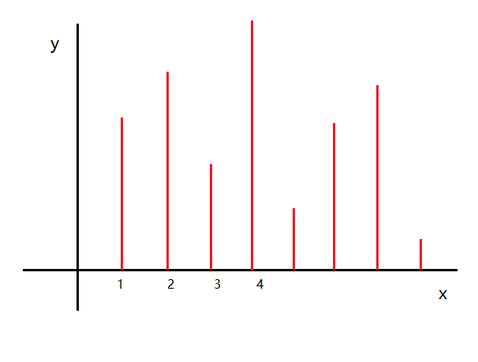

# 011-container-with-most-water

## Question {#question}

[https://leetcode.com/problems/container-with-most-water/description/](https://leetcode.com/problems/container-with-most-water/description/)

Given non-negative integers a1,a2, ...,an, where each represents a point at coordinate \(i,ai\).n vertical lines are drawn such that the two endpoints of line i is at \(i,ai\) and \(i, 0\). Find two lines, which together with x-axis forms a container, such that the container contains the most water.

Note: You may not slant the container and n is at least 2.

**Example:**



## Thought Process {#thought-process}

1. Brute Force
   1. Start with each vertical line as the container's left boundary
   2. Pick every one of the remaining vertical line as the right boundary
   3. Volume = \(x2 - x1\) \* min\(y2, y1\)
   4. Time complexity is O\(n\)
   5. Space complexity is O\(1\)
2. Two pointers
   1. Start with pointer at left and right, this could potentially by our largest container because the widest length
   2. We compute the volume same way as before
   3. Because only the larger height will be most useful in getting larger volume, we shrink the side that has lesser height
   4. Time complexity is O\(n\)
   5. Space complexity is O\(1\)

## Solution

```java
class Solution {
    public int maxArea(int[] height) {
        int maxArea = 0, l = 0, r = height.length - 1;
        while (l < r) {
            maxArea = Math.max(maxArea, Math.min(height[l], height[r]) * (r - l));
            if (height[l] > height[r]) r--;
            else l++;
        }
        return maxArea;
    }
}
```

## Additional {#additional}

