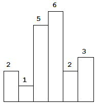
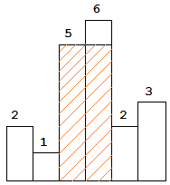

# 084-largest-rectangle-in-histogram

## Question {#question}

[https://leetcode.com/problems/largest-rectangle-in-histogram/description/](https://leetcode.com/problems/largest-rectangle-in-histogram/description/)

Given n non-negative integers representing the histogram's bar height where the width of each bar is 1, find the area of largest rectangle in the histogram.



Above is a histogram where width of each bar is 1, given height =`[2,1,5,6,2,3]`.



The largest rectangle is shown in the shaded area, which has area =`10`unit.

**Example:**

```text
Given heights = [2,1,5,6,2,3],
return 10.
```

## Thought Process {#thought-process}

1. Brute Force
   1. For each column, we compute the area adding one by one for the remaining columns
   2. Time complexity O\(n^2\)
   3. Space complexity O\(1\)
2. Divide and Conquer
   1. We can simply split this question into subproblems
   2. The max area of the bars is either the area calculated by the min height of array times the width of the array, the left part of the min index, or the right part of min index
   3. Time complexity O\(n logn\), worst case O\(n^2\) if sorted, guranted O\(n log n\) is use segment tree [https://discuss.leetcode.com/topic/45822/segment-tree-solution-just-another-idea-o-n-logn-solution](https://discuss.leetcode.com/topic/45822/segment-tree-solution-just-another-idea-o-n-logn-solution)
   4. Space complexity O\(n\)
3. Stack
   1. Inspired from divide and conqure, the max area is computed from the min height of the range
   2. If we can find the area of using every height as min height, and then we can find the maximum of all the computed areas
   3. To find the area using a particular height as min height, we need to find the index of first lower height on the left and right, let's call it left index and right index
   4. Using stack to push all the height in ascending order, when we encounter a height that is lower than the top of the height, we know we have find our right index
   5. We can simulate the stack using an int array to speed up the process
   6. Time complexity O\(n\)
   7. Space complexity O\(n\)
4. Left and Right Boundary
   1. We use two arrays to hold the boundary of each elements, storing the index of first smaller heights from left and right
   2. We adopt the same formula as above
   3. Time complexity O\(n\), because the the loop until to 0th index for some range, i.e. \[1,2,3,4,5,6,7,1,2,3,4,5,6,7\], 7th to 0th, 14th to 7th
   4. Space complexity O\(n\)

## Solution

Brute Force

```java
class Solution {
    public int largestRectangleArea(int[] heights) {
        int n = heights.length;
        int maxArea = 0;
        for (int i = 0; i < n; i++) {
            int minHeight = Integer.MAX_VALUE;
            for (int j = i; j < n; j++) {
                minHeight = Math.min(minHeight, heights[j]);
                maxArea = Math.max(maxArea, minHeight * (j - i + 1));
            }
        }
        return maxArea;
    }
}
```

Divide and conquer

```java
class Solution {
    public int largestRectangleArea(int[] heights) {
        return maxArea(heights, 0, heights.length - 1);
    }

    private int maxArea(int[] heights, int i, int j) {
        if (i > j) return 0;
        if (i == j) return heights[i];
        int minId = i;
        for (int k = i + 1; k <= j; k++) {
            if (heights[k] < heights[minId]) minId = k;
        }
        int left = maxArea(heights, i, minId - 1);
        int right = maxArea(heights, minId + 1, j);
        int cur = heights[minId] * (j - i + 1);
        return Math.max(left, Math.max(cur, right));
    }
}
```

Stack

```java
class Solution {
    public int largestRectangleArea(int[] heights) {
        if (heights.length == 0) return 0;
        Stack<Integer> stack = new Stack<>();
        stack.push(-1);
        int maxArea = 0;
        for (int i = 0; i <= heights.length; i++) {
            int cur = i == heights.length ? 0 : heights[i];
            while (stack.peek() != -1 && cur < heights[stack.peek()]) {
                maxArea = Math.max(maxArea, heights[stack.pop()] * (i - stack.peek() - 1));
            }
            stack.push(i);
        }
        return maxArea;
    }
}
```

Stack - Using int array

```java
class Solution {
    public int largestRectangleArea(int[] heights) {
        if (heights.length == 0) return 0;
        int[] stack = new int[heights.length + 1];
        int p = -1;
        int maxArea = 0;
        for (int i = 0; i <= heights.length; i++) {
            int cur = i == heights.length ? 0 : heights[i];
            while (p != -1 && cur < heights[stack[p]]) {
                int h = heights[stack[p--]];
                int w = p == -1 ? i : i - stack[p] - 1;
                maxArea = Math.max(maxArea,  h * w);
            }
            stack[++p] = i;
        }
        return maxArea;
    }
}
```

Left and Right Boundary

```java
class Solution {
    public int largestRectangleArea(int[] heights) {
        if (heights.length == 0) return 0;
        int n = heights.length;
        int[] left = new int[n], right = new int[n];
        // find the left and right boundary makes calculation easier
        // (right - left  + 1) * heights[i]
        for (int i = 0; i < n; i++) {
            // find the first index on the left that has lower height than current
            int p = i - 1;
            while (p >= 0 && heights[p] >= heights[i]) p = left[p];
            left[i] = p;
            // find the first index on the right that has lower height than current
            p = n - i;
            while (p < n && heights[p] >= heights[n - 1 - i]) p = right[p];
            right[n - 1 - i] = p;
        }
        int maxArea = 0;
        for (int i = 0; i < n; i++) {
            maxArea = Math.max(maxArea, (right[i] - left[i] - 1) * heights[i]);
        }
        return maxArea;
    }
}
```

## Additional {#additional}

